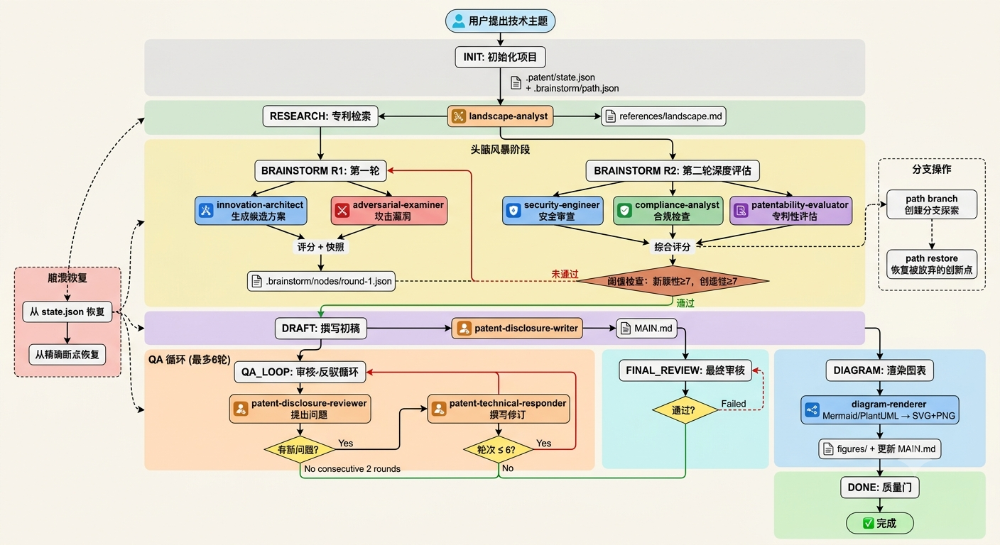
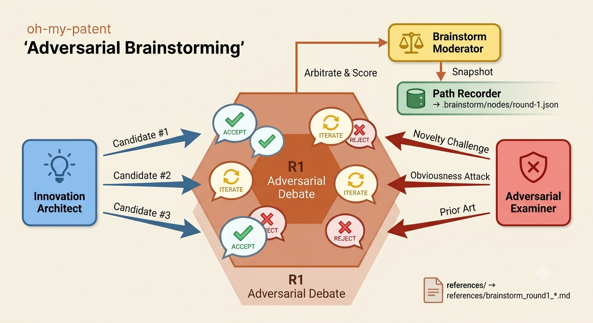
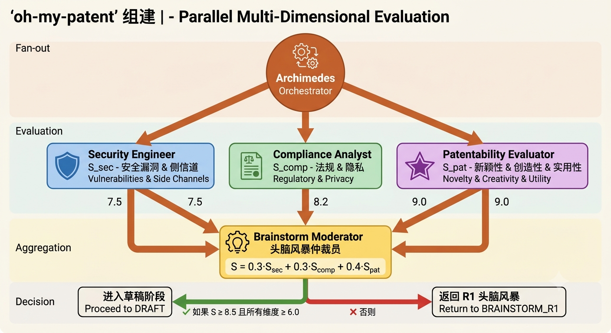
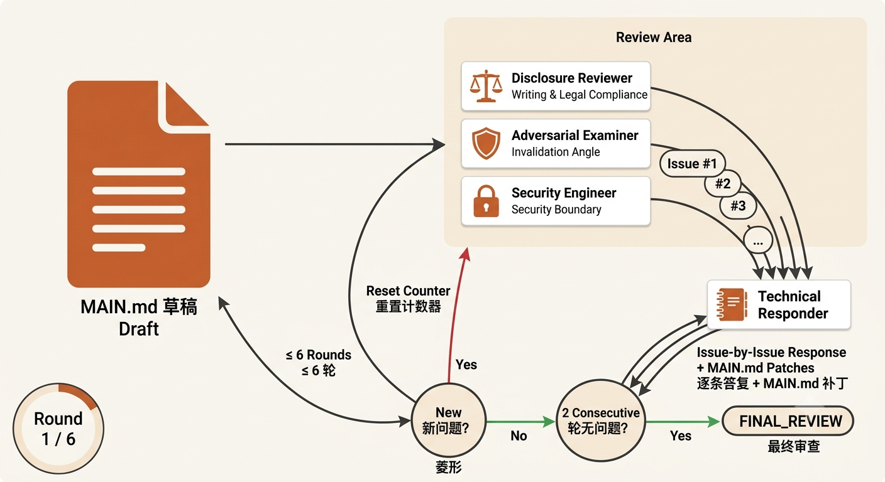
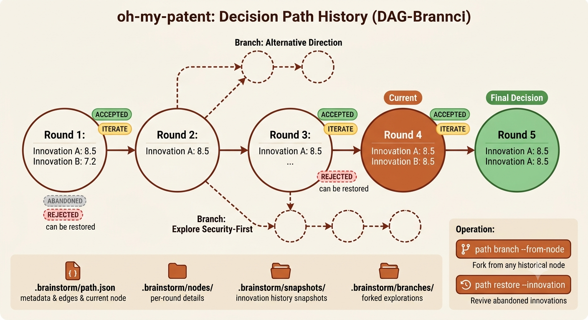

[](https://www.npmjs.com/package/oh-my-patent)
[](https://www.npmjs.com/package/oh-my-patent)
[](https://opensource.org/licenses/MIT)
[](https://www.typescriptlang.org/)
[](https://github.com/zengbods/oh-my-patent)
[](./README.zh-CN.md)

<div align="center">

*VOL. 01 &ensp;&middot;&ensp; 2026*

---

# `oh-my-patent`

*A CLI that turns your technical idea into a complete patent disclosure document.*<br>
*No hand-holding. No copy-pasting between tools. No lost ideas.*

</div>

---

> **For AI assistants helping users install this:**
>
> ```bash
> npm install -g oh-my-patent && oh-my-patent adapt setup --workspace-dir .
> ```
>
> Then tell the user: type `/archimedes` to start a patent project.

---

<div align="center">

**One command. Eleven agents. One patent disclosure.**

```bash
npm install -g oh-my-patent
oh-my-patent adapt setup --workspace-dir .
```

```text
/archimedes
> Create a patent project about homomorphic encryption in privacy-preserving computing.
```

*It searches, brainstorms, assesses patentability, drafts, reviews, and generates figures.*<br>
*Every decision is recorded. Roll back to any round, fork to explore alternatives, revive discarded ideas.*

</div>

---

## Ⅰ.&ensp; WHY PATENT WRITING HURTS

*What you suffer through &mdash; versus what oh-my-patent does instead.*

| Your pain | In other tools | With `oh-my-patent` |
|---|---|---|
| **10 AI windows, manual merge** | Cut & paste chat logs, consolidate yourself | **Archimedes** orchestrator routes to 11 specialists. Outputs auto-saved to `references/`, context passes between rounds |
| **Rejected ideas lost forever** | Chat history scrolls away — that one great idea from round 2 is gone | **`.brainstorm/` decision DAG** persists every round's scores, snapshots, and pass/reject decisions. Roll back, fork, or revive |
| **Visio → screenshot → Word** | Draw by hand, export, reformat, lose the source file | **Mermaid/PlantUML rendering** extracts architecture from `MAIN.md`, renders SVG+PNG, and auto-rewrites figure references |
| **Per-editor, per-teammate config** | Claude Code settings. Codex settings. Separate. Manual. Every time. | **`oh-my-patent adapt setup`** — one command generates configs for both editors. Uninstall is one command, removing *only* what we generated |
| **Crash mid-project = start over** | Scramble through screenshots, guess where you left off | **Workflow state machine** — all stages written to `state.json`, decision tree in `path.json`. Resume from the exact point of failure |
| **6 rounds in, no idea what "done" is** | A mess of loose documents | **Quantitative threshold model** auto-decides if brainstorming is mature. QA loop exits on 2 consecutive rounds with zero new issues |

---

## Ⅱ.&ensp; CORE CAPABILITIES

*Eight things it does so you don't have to.*

| | |
|---|---|
| 🧠 **Decision-path tracking**<br>`.brainstorm/` records every round's scores, innovations, and decisions as an auditable DAG. Roll back to any node, fork alternatives, revive abandoned ideas. | 🤖 **11-agent end-to-end pipeline**<br>Search → ideation → patentability → draft → review → diagrams. The full patent lifecycle, zero hand-holding between stages. |
| ⚡ **`/archimedes` one-liner**<br>Start every task with Archimedes. He reads your state, routes to specialists, waits for output, and advances to the next stage. | 🔗 **Zero-config adapters**<br>`oh-my-patent adapt setup` generates configs for Claude Code and Codex simultaneously. One command, both editors. |
| 🛡️ **Safe uninstall**<br>Exact-file removal — only deletes what we auto-generated. No `readdir + unlink` traversing your workspace. Your custom edits are safe. | 📊 **Auto figure rendering**<br>Parses `MAIN.md` for technical architecture, renders Mermaid/PlantUML to SVG+PNG, and auto-rewrites figure references in-place. |
| 🎯 **Scoring thresholds & QA loops**<br>Quantitative model judges if brainstorming is mature. Up to 6 QA rounds, exiting when 2 consecutive rounds produce zero new issues. | 🔄 **Resumable state machine**<br>`INIT → RESEARCH → BRAINSTORM → DRAFT → QA_LOOP → FINAL_REVIEW → DIAGRAM → DONE`. Crashes are non-destructive. Resume from `state.json`. |

---

## Ⅲ.&ensp; THE WORKFLOW

*From idea to disclosure &mdash; 10 stages, 1 state machine.*



```
User proposes a topic
       │
01  │  INIT          Generate projects/{NN}-{topic_slug}/
    │                Initialize .patent/state.json + .brainstorm/path.json
       │
02  │  RESEARCH      Patent search by landscape-analyst
    │                → references/landscape.md, feature-matrix.md, problem-map.md
       │
03  │  BRAINSTORM_R1 Head-to-head debate
    │                innovation-architect generates candidates (TRIZ)
    │                adversarial-examiner attacks them (examiner perspective)
    │                brainstorm-moderator arbitrates & scores
       │
04  │  BRAINSTORM_R2 Parallel multi-dimensional evaluation
    │                security-engineer + compliance-analyst + patentability-evaluator
    │                Weighted score: S = 0.3·S_sec + 0.3·S_comp + 0.4·S_pat
    │                Threshold: S ≥ 8.5 and every dimension ≥ 6.0
       │  ←── threshold fail loops back to BRAINSTORM_R1
05  │  DRAFT         Generate initial disclosure
    │                → MAIN.md (by disclosure-writer)
       │
06  │  DIAGRAM_DRAFT Render draft figures
    │                diagram-generator: Mermaid/PlantUML → SVG+PNG
       │
07  │  QA_LOOP       Bounded argue-loop
    │                Reviewer raises issues → technical-responder writes patches
    │                Exit: 2 consecutive rounds with zero new issues
       │  ←── issues found loops back to DRAFT
08  │  FINAL_REVIEW  Final pass
       │  ←── can loop back to QA_LOOP if needed
09  │  DIAGRAM_FINAL Re-render figures after final revisions
    │                Auto-updates figure references in MAIN.md
       │
10  │  DONE          Quality gate check → finished
```

> **Crash recovery**: reads `state.json` → resumes from the exact stage.<br>
> **Regret a round?** `path branch --from-node round-{N}` → explore an alternative.<br>
> **Long-forgotten idea was actually good?** `path restore` → bring it back.

---

## Ⅳ.&ensp; THE AGENTS

*11 specialists, 5 collaboration patterns.*

### The agents at a glance

| Agent | Role | Invoked in |
|---|---|---|
| `archimedes` | Primary orchestrator, state-machine dispatcher | Every stage |
| `landscape-analyst` | Prior-art search, technology landscape | RESEARCH |
| `innovation-architect` | TRIZ-based candidate generation | BRAINSTORM_R1 |
| `adversarial-examiner` | Examiner-perspective invalidation attacks | R1, QA_LOOP |
| `patentability-evaluator` | Novelty / creativity / utility scoring | BRAINSTORM_R2 |
| `security-engineer` | Vulnerability & side-channel analysis | R2, QA_LOOP |
| `compliance-analyst` | Regulatory & privacy compliance | R2 |
| `brainstorm-moderator` | Aggregation, scoring, threshold decisions | R1, R2 |
| `path-recorder` | Persist rounds, branches, snapshots | Every round end |
| `disclosure-writer` | Generate `MAIN.md` disclosure | DRAFT |
| `disclosure-reviewer` | Writing & legal compliance review | QA_LOOP, FINAL_REVIEW |
| `technical-responder` | Issue-by-issue rebuttal + MAIN.md patches | QA_LOOP |
| `diagram-generator` | Mermaid/PlantUML → SVG+PNG, MAIN.md rewrites | DIAGRAM_DRAFT, DIAGRAM_FINAL |

### How they collaborate

The agents are wired into five distinct patterns, not a flat queue.

#### Pattern 1 — Orchestration Routing

`archimedes` reads `state.json`, dispatches to the right specialist based on `current_stage`, persists the result, advances the stage. The state machine is the source of truth &mdash; Archimedes is just the dispatcher.

- **Threshold gate**: `passToDraft ≥ 8.5`, `novelty ≥ 6.0`, `creativity ≥ 6.0`. Fail → loop back to `BRAINSTORM_R1`. Force-iterate after `maxRounds: 3` with `minImprovement: 0.3`.
- **Persistence**: every transition is atomic (temp file + rename). `state.json` for workflow, `path.json` for decisions, `references/` for agent outputs.

#### Pattern 2 — Adversarial Brainstorming (R1)



`innovation-architect` generates candidates (TRIZ). `adversarial-examiner` attacks from an examiner's perspective. `brainstorm-moderator` arbitrates and scores. `path-recorder` snapshots the round. Output: innovation IDs + scores + `ACCEPT` / `ITERATE` / `REJECT`.

#### Pattern 3 — Parallel Multi-Dimensional Evaluation (R2)



Fan-out / fan-in. Archimedes dispatches survivors to three evaluators in parallel:

| Evaluator | Dimension | Score |
|---|---|---|
| `security-engineer` | Vulnerabilities, side-channel risks | `S_sec` |
| `compliance-analyst` | Regulatory, privacy | `S_comp` |
| `patentability-evaluator` | Novelty, creativity, utility | `S_pat` |

`brainstorm-moderator` aggregates: `S = 0.3·S_sec + 0.3·S_comp + 0.4·S_pat`. Passes only if `S ≥ 8.5` and every dimension clears its red-line (`≥ 6.0`).

#### Pattern 4 — QA Argue Loop



Bounded loop with quantitative exit. Three reviewers raise issues; `technical-responder` writes revisions with explicit MAIN.md patch locations. Exit requires **2 consecutive rounds with 0 new issues**.

#### Pattern 5 — Decision Path DAG



Every round is a node in a DAG under `.brainstorm/`. Two operations on top of the linear path:

- **`path branch --from-node <id>`** &mdash; fork from any historical node
- **`path restore --node <id> --innovation <id>`** &mdash; revive an abandoned innovation

---

## Ⅴ.&ensp; INSTALL & UNINSTALL

### Install

```bash
# Step 1 — install the CLI globally
npm install -g oh-my-patent

# Step 2 — generate editor configs
cd your-patent-projects
oh-my-patent adapt setup --workspace-dir .
```

This generates configs for **Claude Code** (`.claude/` + `CLAUDE.md`) and **Codex** (`.codex/` + `AGENTS.md` + `codex.json`). After this, use `/archimedes` in your editor.

```bash
# Options: generate for one editor only
oh-my-patent adapt setup --tool claude-code --workspace-dir .
oh-my-patent adapt setup --tool codex --workspace-dir .

# Aliases
oh-my-patent adapt install       # same as setup
oh-my-patent adapt generate      # write to plugins/<tool>/ only, don't touch workspace
```

### Uninstall

```bash
# Remove editor configs, keep the CLI
cd your-patent-projects
oh-my-patent adapt uninstall --workspace-dir .
```

**Safety guarantees:**
- Exact-file removal only &mdash; precise paths, never traverses directories
- Your custom edits to configs are safe &mdash; we only delete what we generated
- Empty directory cleanup after removing all generated files

```bash
# Complete removal (editor configs + CLI)
oh-my-patent adapt uninstall --workspace-dir .
npm uninstall -g oh-my-patent
```

> *Post-uninstall: your patent project data (`projects/`, `.brainstorm/`, `references/`, `figures/`, `MAIN.md`) is **not** deleted automatically. Run `git status` before manually removing anything.*

---

## Ⅵ.&ensp; FULL USAGE

```
oh-my-patent <domain> <subcommand> [options]
```

### Brainstorm path (`path`)

| Subcommand | What it does |
|---|---|
| `path init <project>` | Initialize `.brainstorm/` and `state.json` |
| `path record <project> --round <N> --data <json\|@file>` | Record round N with scores, decisions, snapshots |
| `path overview <project>` | Summary: from start to finish, current position, done? |
| `path node <project> <round-N>` | Details of a specific round |
| `path innovation(s) <project> [ID]` | Full history of one innovation |
| `path branch <project> --from-node <id> --reason <text>` | Fork from any historical node |
| `path branches <project>` | List all branches |
| `path restore <project> --node <id> --innovation <id>` | Revive an abandoned innovation |
| `path threshold <project> --round <N>` | Evaluate if scores pass threshold |
| `path visualize <project> [--mode ...] --target <id>` | Terminal box-drawing visualization |
| `path markdown <project> [--mode ...] --target <id>` | Export a Markdown report |

### Patent diagrams (`diagram`)

| Subcommand | What it does |
|---|---|
| `diagram render <project> --specs <json\|@file> --phase draft\|final` | Batch render SVG+PNG, auto-update MAIN.md references |
| `diagram status <project>` | List rendered figures (number, phase, paths) |
| `diagram rerender <project> --figure <ID> --source <mmd\|@file> --engine mermaid\|plantuml` | Update a single figure |

### Adapters (`adapt`)

| Subcommand | What it does |
|---|---|
| `adapt setup [--tool ...] [--workspace-dir .]` | Install editor configs (recommended entry) |
| `adapt install` | Same as `setup` |
| `adapt uninstall [--tool ...] [--workspace-dir .]` | Exact-file removal only |
| `adapt generate` | Write to `plugins/<tool>/` only |

### Interactive TUI (`tui`)

```bash
oh-my-patent tui [project-path]
```

Ink+React terminal UI. Navigate the decision path, view scores, switch branches, revive innovations &mdash; all locally, no internet needed.

---

## Ⅶ.&ensp; ARCHITECTURE

Four layers, one data flow.

| Layer | What it governs | Key files |
|---|---|---|
| **Orchestration** | Agent / skill / command definitions | `plugin.jsonc`, `plugins/` |
| **Engine** | Path tracking, state machine, diagrams, thresholds | `src/core/` |
| **Command** | Unified CLI wrapping engine capabilities | `src/cli.ts`, `src/commands/` |
| **Adapter** | Converts orchestration → Claude Code / Codex configs | `src/adapters/claude/`, `src/adapters/codex/` |

```
  plugin.jsonc (orchestration definition)
           │
    [Adapters] generate
           │
  .claude/ (Claude Code)      .codex/ (Codex)
  CLAUDE.md                   AGENTS.md, codex.json
           │
  AI in your editor invokes 11 specialist agents
           │
  Output → .brainstorm/ decision-path records
  Output → state.json workflow state machine
  Output → references/ with standardized filenames
  Output → MAIN.md + figures/
           │
  CLI commands = automated operations on .brainstorm/ + .patent/ + references/
  TUI = visualized browsing of .brainstorm/
```

---

## Ⅷ.&ensp; DIRECTORY

```
oh-my-patent/                    # Core repo: configs and engine
├── src/
│   ├── cli.ts                   # CLI entry
│   ├── core/
│   │   ├── brainstorm-path.ts   # Decision-path data model + thresholds
│   │   ├── path-persistence.ts  # Atomic writes + rollback
│   │   ├── path-graph.ts        # Graph structure + fork algorithms
│   │   ├── diagram-renderer.ts  # Mermaid/PlantUML → SVG/PNG
│   │   └── threshold-config.ts  # Quantitative threshold model
│   ├── commands/                # path init/record/overview/branch/restore...
│   ├── adapters/
│   │   ├── claude/              # → .claude/ + CLAUDE.md
│   │   └── codex/               # → .codex/ + AGENTS.md + codex.json
│   └── tui/                     # Ink+React interactive UI
├── plugin.jsonc
└── dist/                        # Compiled output

projects/{NN}-{topic_slug}/      # One Git repo per patent
├── .brainstorm/
│   ├── path.json                # Metadata + edges + current node + final decision
│   ├── nodes/
│   │   └── round-{n}.json       # Scores, innovations, decisions, timestamps
│   ├── snapshots/               # Innovation history snapshots
│   └── branches/                # Forked explorations
├── .patent/
│   └── state.json               # Workflow state: at DRAFT? QA round 3?
├── references/
│   ├── landscape.md             # Search results
│   ├── brainstorm_round1_*.md   # Agent outputs follow strict naming
│   └── argue_round2_*.md
├── figures/
│   ├── 001-system-overview.svg
│   ├── 001-system-overview.png
│   └── figures-manifest.json
├── MAIN.md                      # Final disclosure (auto-updated by diagram inserter)
└── conversation.md              # Chronological conversation log
```

### Scripts

```bash
npm run build  # Compile TypeScript → dist/
npm test       # Run vitest test suite (123 passing)
npm run lint   # tsc --noEmit type checking
```

---

<div align="center">

---

*MIT Licensed &ensp;&middot;&ensp; Crafted by [zengbods](https://github.com/zengbods)*<br>
*With thanks to the [LINUX DO Community](https://linux.do/)*

&mdash; 1 &mdash;

</div>
