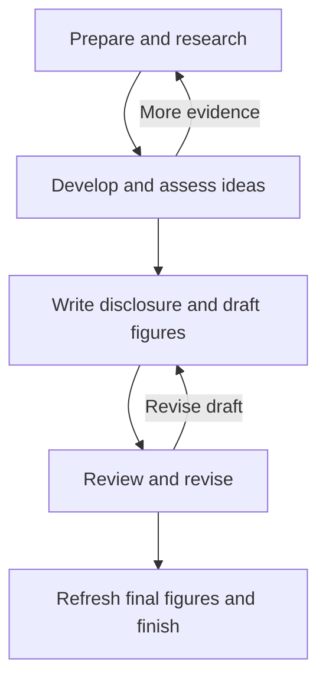

# oh-my-patent

[](https://www.npmjs.com/package/oh-my-patent)
[](https://www.npmjs.com/package/oh-my-patent)
[](./LICENSE)
[](https://www.typescriptlang.org/)
[](./README.zh-CN.md)

<p align="center">
<picture>
  <source media="(prefers-color-scheme: dark)" srcset="./assets/brand/png/logo-on-dark.png">
  
</picture>
</p>

**Meet Archimedes. Turn your “Eureka!” into a patent disclosure.**

An AI patent plugin for **Claude Code, Codex, and OpenCode**.
Archimedes orchestrates specialist agents across research, ideation, drafting,
review, and diagrams—with traceable, forkable decision paths.

## Quick start

Run these commands in your patent workspace. Setup writes editor configuration;
see [installation behavior](./docs/usage-en.md#installation) before using an existing workspace.

```bash
npm install -g oh-my-patent
oh-my-patent adapt setup --workspace-dir .
```

Open that workspace in your AI coding tool, load the generated integration, and start with:

```text
/archimedes
> Create a patent project about homomorphic encryption in privacy-preserving computing.
```

Use `--tool claude-code`, `--tool codex`, or `--tool opencode` to configure one
platform. Without `--tool`, setup targets all three. See the
[platform notes](./docs/usage-en.md#platform-notes) if the entry point is unavailable.

<details>
<summary>For AI assistants helping users install this</summary>

Choose the user's patent workspace, review the installation behavior above, and run:

```bash
npm install -g oh-my-patent
oh-my-patent adapt setup --workspace-dir .
oh-my-patent check --workspace-dir .
```

Then help the user load the integration and start a project with `/archimedes`.

</details>

## What you can do

| Capability | What it gives you |
|---|---|
| Coordinate specialist agents | Research, ideation, patentability assessment, drafting, review, and technical responses under one orchestrator |
| Keep decisions traceable | Saved rounds, scores, innovation snapshots, and reasons in `.brainstorm/`; branch from a recorded node or restore an idea |
| Resume recorded work | Workflow state in `.patent/state.json` and agent outputs in `references/` provide context for continuing a project |
| Generate patent figures | Mermaid or PlantUML sources rendered to SVG and PNG, with figure references inserted into `MAIN.md` |
| Inspect progress | CLI queries, Markdown reports, a terminal UI, and environment checks |

The project brings the disclosure, its supporting material, and its decision history
together in one project directory. Rendering engines and retrieval services have
their own setup requirements; see the [usage guide](./docs/usage-en.md).

## From idea to disclosure



*Overview of the ten stages, grouped by purpose. Arrows back to research and
drafting show where further work may be needed.*

| Step | Workflow stages |
|---|---|
| Prepare and research | `INIT` → `RESEARCH` |
| Develop and assess ideas | `BRAINSTORM_R1` → `BRAINSTORM_R2` |
| Write and illustrate | `DRAFT` → `DIAGRAM_DRAFT` |
| Review and revise | `QA_LOOP` → `FINAL_REVIEW` |
| Refresh figures and finish | `DIAGRAM_FINAL` → `DONE` |

Review can return to earlier stages. The [workflow reference](./docs/workflow-diagram-en.md)
shows the supported transitions and explains scoring decisions separately from stage changes.

## How the team works

| Pattern | Purpose |
|---|---|
| Orchestration | Archimedes coordinates specialists and carries project context between stages |
| Adversarial brainstorming | Candidate ideas receive examiner-style challenges before selection |
| Parallel evaluation | Security, compliance, and patentability specialists assess different dimensions |
| Review and response | Reviewers raise issues; the technical responder proposes document changes |
| Decision recording | The path recorder preserves rounds for comparison, branching, and recovery |

The [agent reference](./docs/agents-en.md) lists the 14 registered agents, 6 skills,
9 commands, and their roles. Actual dispatch uses the capabilities of the selected host.

## Documentation

| Read next | Contents |
|---|---|
| [Usage and CLI](./docs/usage-en.md) | Installation, platform differences, all CLI domains, and uninstall behavior |
| [Workflow](./docs/workflow-diagram-en.md) | Ten stages, review loops, and threshold behavior |
| [Agents and collaboration](./docs/agents-en.md) | Registered IDs, skills, commands, and collaboration patterns |
| [Architecture and development](./docs/architecture-en.md) | Four layers, repository layout, project files, and development commands |
| [Documentation index](./docs/README-en.md) | Bilingual guides and design references |
| [Brand guide](./assets/brand/README.md) | Archimedes artwork and usage rules |

Contributions are welcome. Read [CONTRIBUTING.md](./CONTRIBUTING.md) or
[report an issue](https://github.com/illusionaireal/oh-my-patent/issues).
Licensed under [MIT](./LICENSE).

*With thanks to the* [*LINUX DO Community*](https://linux.do/)
