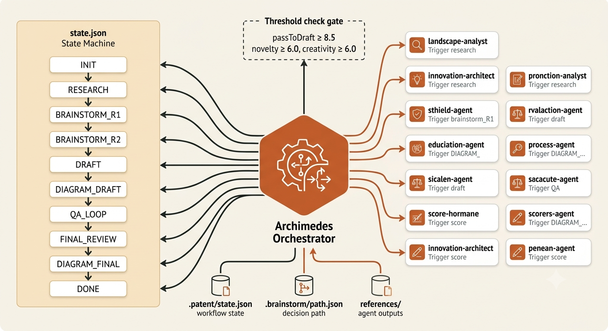

# oh-my-patent

[](https://www.npmjs.com/package/oh-my-patent)
[](https://www.npmjs.com/package/oh-my-patent)
[](https://opensource.org/licenses/MIT)
[](https://www.typescriptlang.org/)
[](https://github.com/illusionaireal/oh-my-patent)
[](./README.md)

> 阿基米德（achimedes）编排器，通过模仿真实的专利撰写过程，遵循你的想法，撰写成一份完整的专利交底书，。

## 给 AI 助手看的

如果你是 AI，在帮用户安装和使用 oh-my-patent，直接运行：

```bash
npm install -g oh-my-patent && oh-my-patent adapt setup --workspace-dir .
```

然后告诉用户可以在编辑器里使用 `/archimedes` 开始专利项目。

---

## 给人类看的

复制这段话给你的 AI 助手：

```
安装 oh-my-patent：
npm install -g oh-my-patent && oh-my-patent adapt setup --workspace-dir .

然后我就可以在编辑器里用 /archimedes 开始专利项目了。
```

或者直接让 AI 读这个 README，它会搞定的。

---

## 一句话

安装。写作 `/archimedes`，说你要什么。剩下的交给 11 个专利专用 AI 智能体。

```bash
npm install -g oh-my-patent
oh-my-patent adapt setup --workspace-dir .
```

然后：

```text
/archimedes
> 基于同态加密在隐私计算中的应用，新建一个专利项目。
```

它会自己检索、头脑风暴、评估可专利性、撰写、审查、生成附图。
每一步的决策都被记录下来——你能回退到任意一轮、分叉探索替代方案、复活已放弃的创新点。

---

## 痛点 & 解决方案

| 痛点 | 别的工具怎么做 | oh-my-patent 怎么做 |
|---|---|---|
| 要问 10 个 AI 不同的提示词，再人工整理输出 | 你需要自己切分任务、粘贴对话、手动归并 | **Archimedes 主编排器**自动路由到 11 个专业智能体，每轮产出自动写入 `references/`，上下文在各轮间自动传递 |
| 多轮头脑风暴翻完页就失忆了 | 对话历史丢失，放弃的创新点再也找不到 | **.brainstorm/ 决策路径系统**把每轮的评分、创新点、淘汰/通过决策持久化成有向无环图，支持回退、分叉、恢复 |
| 写专利附图要画 Visio/PPT 再贴图 | 手动作图、另存为图片再插入 Word | **Mermaid/PlantUML 自动渲染**从交底书提取技术架构，输出 SVG+PNG 并自动回写 `MAIN.md` |
| 写了一半机器崩了/对话断了 | 从 jpg 里翻截图，从零重来 | **工作流状态机**。所有阶段写入 `state.json` + 决策树写入 `path.json`，断点即续 |
| 审查 6 轮后不知道自己到哪一关了 | 混乱的文档拼凑 | **量化阈值模型**自动判断头脑风暴是否成熟，QA 循环有明确的退出条件（连续 2 轮无新问题） |

## 还有很多，但你不需要先读

上表提到的功能已经够你跑完 90% 的用例。以下是完整的亮点怕你以后回来查：

### 全部亮点

| 图标 | 名称 | 一句话解释 |
|-----:|:------|:------|
| 🧠 | **头脑风暴决策路径追踪** | `.brainstorm/` 里自动保存每轮的评分、创新点、淘汰/通过决策。能回退到任意节点、分叉探索替代方向、复活已放弃创新点 |
| 🤖 | **11 智能体端到端流水线** | 检索 → 创意激发 → 可专利性评估 → 撰写 → 审查 → 答辩 → 附图，覆盖交底书全生命周期 |
| ⚡ | **`/archimedes` 一句话启动** | 不管什么命令，先找 Archimedes。他判断阶段、分配任务、传递上下文、等待产出、推进下一关 |
| 🔗 | **零配置跨工具适配器** | `oh-my-patent adapt setup` 一条命令给 Claude Code、Codex 和 OpenCode 同时注册配置 |
| 🛡️ | **安全卸载** | 精确文件级清理——只删自动生成的文件，绝不 `readdir + unlink` 遍历你工作区 |
| 📊 | **自动附图渲染** | 解析 MAIN.md 中的技术架构描述，Mermaid/PlantUML → SVG/PNG，自动回写 |
| 🎯 | **评分阈值与 QA 循环** | 量化阈值模型自动判断头脑风暴够不够深入；审查阶段最多 6 轮 QA 循环，直到连续 2 轮无新问题 |
| 💻 | **交互式终端蓝草图** | 基于 Ink+React 的 TUI，本地可视化浏览决策路径、节点详情、分支概览 |
| 🔄 | **可恢复工作流** | `INIT → RESEARCH → BRAINSTORM → DRAFT → QA_LOOP → FINAL_REVIEW → DIAGRAM → DONE`，机器崩溃也能从 `state.json` 接上 |

## 安装步骤

### 第1步：全局安装CLI工具

```bash
npm install -g oh-my-patent
```

这会在系统中全局安装 `oh-my-patent` 命令。

### 第2步：生成编辑器配置

进入你的项目目录并运行：

```bash
cd your-patent-projects
oh-my-patent adapt setup --workspace-dir .
```

这会生成：
- **Claude Code**: `.claude/agents/`, `.claude/commands/`, `CLAUDE.md`
- **Codex**: `.codex/agents/`, `.codex/skills/`, `AGENTS.md`
- **OpenCode**: `.opencode/agent/`, `.opencode/command/`, `.opencode/skills/`

完成后，你就可以在编辑器中使用 `/archimedes` 等命令了。

**其他选项**：
```bash
# 只为特定工具生成配置
oh-my-patent adapt setup --tool claude-code --workspace-dir .
oh-my-patent adapt setup --tool codex --workspace-dir .
oh-my-patent adapt setup --tool opencode --workspace-dir .

# 其他命令
oh-my-patent adapt install     # setup的别名
oh-my-patent adapt uninstall   # 删除生成的配置
oh-my-patent adapt generate    # 仅写入./plugins/<tool>/，不修改工作区
```

### 给AI助手的安装指令

如果你是AI助手，在帮助用户安装oh-my-patent时，使用此命令：

```bash
npm install -g oh-my-patent && cd /path/to/user/project && oh-my-patent adapt setup --workspace-dir .
```

将 `/path/to/user/project` 替换为实际的项目目录路径。

### 本地开发

```bash
# 克隆项目
git clone https://github.com/illusionaireal/oh-my-patent
cd oh-my-patent
npm install
npm run build
```

构建后使用 `node dist/cli.js` 或 `npx -p . oh-my-patent`。

---

## 卸载

### 卸载编辑器配置（保留 oh-my-patent CLI）

如果只想移除编辑器配置（`.claude/`, `.codex/`, `CLAUDE.md` 等），保留全局 CLI 工具：

```bash
cd your-patent-projects
oh-my-patent adapt uninstall --workspace-dir .
```

这会删除以下文件：
- **Claude Code**: `.claude/agents/*.md`, `.claude/commands/*.md`, `.claude/settings.json`, `CLAUDE.md`
- **Codex**: `.codex/agents/*.md`, `.codex/skills/*.md`, `AGENTS.md`, `codex.json`
- **OpenCode**: `.opencode/agent/*.md`, `.opencode/command/*.md`, `.opencode/skills/*/SKILL.md`
- **全局配置**: `~/.claude-best/agents/*.md`, `~/.claude-best/commands/*.md`（如果有）

**安全保证**：
- ✅ **仅删除自动生成的文件** — 使用精确文件路径，绝不遍历目录删除
- ✅ **不碰用户自定义文件** — 如果你手动修改了配置，卸载不会删除它们
- ✅ **空目录清理** — 只在目录完全为空时才删除目录本身

**指定工具卸载**：
```bash
# 只卸载 Claude Code 配置
oh-my-patent adapt uninstall --tool claude-code --workspace-dir .

# 只卸载 Codex 配置
oh-my-patent adapt uninstall --tool codex --workspace-dir .

# 只卸载 OpenCode 配置
oh-my-patent adapt uninstall --tool opencode --workspace-dir .
```

### 完全卸载（包括 CLI 工具）

如果要完全移除 oh-my-patent：

```bash
# 1. 先卸载编辑器配置
cd your-patent-projects
oh-my-patent adapt uninstall --workspace-dir .

# 2. 再卸载全局 CLI
npm uninstall -g oh-my-patent
```

### 卸载后清理（可选）

以下文件/目录是你的专利项目数据，**不会被自动删除**。如果确认不再需要，可手动删除：

```bash
# 专利项目数据目录
projects/                   # 所有专利项目
your-patent-projects/.brainstorm/   # 决策路径数据
your-patent-projects/.patent/       # 工作流状态
your-patent-projects/references/    # 智能体产出
your-patent-projects/figures/       # 渲染的附图
your-patent-projects/MAIN.md        # 交底书
your-patent-projects/conversation.md # 对话记录
```

**提示**：建议在删除前用 `git status` 检查是否有未提交的更改。

---

## 完整用法

```
oh-my-patent <域> <子命令> [选项]
```

### 头脑风暴路径（`path`）：追踪、分叉、评估

| 子命令 | 用途 |
|--------|------|
| `path init <项目>` | 初始化 `.brainstorm/` 目录结构和 `state.json` |
| `path record <项目> --round <N> --data <json\|@文件>` | 记录第 N 轮完整数据（评分、决策、创新点快照） |
| `path overview <项目>` | 路径概览：从哪到哪、当前在哪、是否完成 |
| `path node <项目> <round-N>` | 查看某轮详情：谁说了什么、创新点评分、最终决策 |
| `path innovation(s) <项目> [ID]` | 一个创新点的全部历史（哪轮提出、哪轮评估、后来去哪了） |
| `path branch <项目> --from-node <id> --reason <原因>` | **分叉**——从任意历史节点，用不同理由跑替代方案 |
| `path branches <项目>` | 列出所有分支 |
| `path restore <项目> --node <id> --innovation <id>` | **复活**——把一个已放弃的创新点重新带回讨论 |
| `path threshold <项目> --round <N>` | 该轮评分是否通过阈值，给出建议（继续迭代 / 进入撰写） |
| `path visualize <项目> [--mode overview\|node\|innovation\|branch\|dashboard] --target <id>` | 终端 box-drawing 可视化 |
| `path markdown  <项目> [--mode overview\|node\|innovation\|branch] --target <id>` | 导出 Markdown 报告 |

### 专利附图（`diagram`）：自动提取、渲染、回写

| 子命令 | 用途 |
|--------|------|
| `diagram render <项目> --specs <json\|@文件> --phase draft\|final` | 批量渲染，输出 SVG+PNG，自动更新 MAIN.md 的图表引用 |
| `diagram status <项目>` | 查看已渲染图表清单（含 figureNumber、phase、文件路径） |
| `diagram rerender <项目> --figure <ID> --source <mmd\|@文件> --engine mermaid\|plantuml` | 更新单图（修改 Mermaid/PlantUML 源码后使用） |

### 适配器（`adapt`）：一条命令适配所有编辑器

| 子命令 | 用途 |
|--------|------|
| `adapt setup [--tool claude-code\|codex\|opencode] [--workspace-dir .]` | 推荐入口。安装编辑器配置，带卸载提示 |
| `adapt install` | 与 `setup` 行为一致 |
| `adapt uninstall [--tool <name>] [--workspace-dir .]` | **只删自动生成的文件**。绝不碰你的自定义文件 |
| `adapt generate` | 只生成到 `plugins/<tool>/`，不写入工作区 |

### 交互式 TUI（`tui`）

```bash
oh-my-patent tui [项目路径]
```

启动 Ink+React 终端界面，键盘浏览决策路径、查看评分、切换分支、恢复创新点。

---

## 工作流

### 端到端流程图


### 详细阶段说明

```
用户提出选题
       ↓
 [INIT]  生成 `projects/{NN}-{topic_slug}/`
         初始化 .patent/state.json + .brainstorm/path.json
       ↓
 [RESEARCH] 专利检索
            → references/landscape.md（由 landscape-analyst 产出）
       ↓
 [BRAINSTORM_R1] 第 1 轮
            多头对战：innovation-architect 生成创意 + adversarial-examiner 砸漏洞
            评分 ↔ 创新点快照 → .brainstorm/nodes/round-1.json
       ↓
 [BRAINSTORM_R2] 第 2 轮
            深度评估：security-engineer + compliance-analyst + evaluator
       ↓ (threshold 评估通过 / 2 轮)
 [DRAFT]  生成交底书初稿
            → MAIN.md（由 patent-disclosure-writer 产出）
       ↓
 [QA_LOOP] 审查-答辩循环
            reviewer 提问题 → technical-responder 写修订
            ≤ 6 轮，连续 2 轮无新 issue 则退出
       ↓
 [FINAL_REVIEW] 最终审查，决定通过或退回 QA_LOOP
       ↓
 [DIAGRAM] 自动渲染专利附图
            → figures/（SVG + PNG + 回写 MAIN.md）
       ↓
 [DONE]   质量闸门：quality-gate 检查 → 完成

           任意阶段崩溃后：读取 state.json 可精确定位断点
           我不满意某轮结果：path branch --from-node round-{N} 开新分支
           很久以前的创新点其实不错：path restore 复活它
```

## 多智能体协作模式

11 个专业智能体不是简单排队运行的——它们被组合成 **五种不同的协作模式**，每种解决一个特定的协调问题。下面拆解每种模式：谁和谁对话、决策落在哪里。

### 模式 1 — 编排路由（Archimedes + 状态机）



**问题**：11 个智能体、10 个工作流阶段、1 个用户。谁来调度下一步？

**解决方案**：`archimedes` 是唯一的主智能体。他读取 `.patent/state.json`，根据 `current_stage` 分派到正确的专业智能体，持久化产出，推进阶段。状态机是真相来源，Archimedes 只是调度器。

- **阈值门**（`threshold-config.ts`）：`passToDraft ≥ 8.5`，`redLines.novelty ≥ 6.0`，`redLines.creativity ≥ 6.0`。未通过 → 回到 `BRAINSTORM_R1`。`maxRounds: 3` 且 `minImprovement: 0.3` 时强制迭代。
- **持久化层**：每次转换都是原子的（临时文件 + 重命名）。`state.json` 管工作流，`path.json` 管决策，`references/` 管智能体产出。
- **回环机制**：`QA_LOOP → DRAFT`（发现问题），`FINAL_REVIEW → QA_LOOP`（需修订），阈值未通过 → 回到头脑风暴。

### 模式 2 — 对抗式头脑风暴（R1）


**问题**：创新想法很容易，但经得起审查的不多。纯生成式智能体产出的想法在审查员面前不堪一击。

**解决方案**：R1 是 **头对头辩论**。`innovation-architect` 用 TRIZ 生成候选方案，`adversarial-examiner` 从专利审查员角度攻击（新颖性、显而易见性、现有技术）。`brainstorm-moderator` 仲裁并评分，`path-recorder` 快照保存本轮。

- **攻击边**：审查员将无效化论点打回给架构师，架构师必须修订或替换。
- **产出**：创新点 ID + 评分 + 决策（`ACCEPT` / `ITERATE` / `REJECT`）。
- **持久化**：每个智能体的产出保存为 `references/brainstorm_round1_{agent}.md`；节点保存到 `.brainstorm/nodes/round-1.json`。

### 模式 3 — 并行多维度评估（R2）


**问题**：一个想法可能很新颖但不安全，合规但不具可专利性。单轴评分会漏掉跨维度的问题。

**解决方案**：R2 是 **扇出/扇入**。Archimedes 将存活下来的创新点并行分发给三个评估者，各自打分：

| 评估者 | 维度 | 评分 |
|--------|------|------|
| `security-engineer` | 漏洞、侧信道风险 | `S_sec` |
| `compliance-analyst` | 法规、隐私 | `S_comp` |
| `patentability-evaluator` | 新颖性、创造性、实用性 | `S_pat` |

`brainstorm-moderator` 用加权公式聚合：`S = 0.3·S_sec + 0.3·S_comp + 0.4·S_pat`。只有 `S ≥ 8.5` **且**每个维度都通过红线（`≥ 6.0`）才算通过。

### 模式 4 — QA 答辩循环（审查员 ↔ 答辩人）


**问题**：撰写 → 审查 → 修订 → 再审查，无限循环。没有退出规则，永远发不了版。

**解决方案**：**有界答辩循环**，带量化退出条件。每轮三个审查员提出问题，`technical-responder` 逐条修订并标明 MAIN.md 的补丁位置。**连续 2 轮无新问题**即退出。

- **审查员**：`disclosure-reviewer`（撰写/法律）、`adversarial-examiner`（无效化角度）、`security-engineer`（安全边界）。
- **答辩人**：`technical-responder` 逐条回答并将补丁定位到 MAIN.md 的对应章节。
- **回环**：任何新问题都会重置计数器。`FINAL_REVIEW` 也可以踢回 `QA_LOOP`。

### 模式 5 — 决策路径有向无环图（分叉 & 恢复）


**问题**：线性头脑风暴会丢失替代方案。你在第 1 轮放弃的想法可能在第 3 轮才是对的。

**解决方案**：每一轮都是 `.brainstorm/` 下 DAG 中的一个节点。在线性路径之上有两个操作：

- **`path branch --from-node <id>`** — 从任意历史节点分叉，探索替代方向。每个分支在 `branches/{branchId}/` 下有独立的子路径。
- **`path restore --node <id> --innovation <id>`** — 复活一个已放弃的创新点（状态 `REJECTED` 或 `ABANDONED`），带回当前轮，可选附带新的差异化说明。

DAG 是可审计的记录：`path.json`（元数据 + 边 + 当前节点）、`nodes/round-{n}.json`（每轮详情）、`snapshots/`（创新点历史）、`branches/`（分叉探索）。

### 11 个智能体一览

| 智能体 | 角色 | 被调用阶段 |
|--------|------|-----------|
| `archimedes` | 主编排器，状态机调度器 | 每个阶段 |
| `patent-landscape-analyst` | 现有技术检索、技术 landscape | RESEARCH |
| `patent-innovation-architect` | 基于 TRIZ 的候选方案生成 | R1 |
| `patent-adversarial-examiner` | 审查员视角的无效化攻击 | R1, QA_LOOP |
| `patentability-evaluator` | 新颖性/创造性/实用性评分 | R2 |
| `patent-security-engineer` | 漏洞 & 侧信道分析 | R2, QA_LOOP |
| `patent-product-compliance-analyst` | 法规 & 隐私合规 | R2 |
| `patent-brainstorm-moderator` | 聚合、评分、阈值决策 | R1, R2 |
| `patent-path-recorder` | 持久化轮次、分支、快照 | 每轮结束 |
| `patent-disclosure-writer` | 生成 MAIN.md 交底书 | DRAFT |
| `patent-disclosure-reviewer` | 撰写 & 法律合规审查 | QA_LOOP, FINAL_REVIEW |
| `patent-technical-responder` | 逐条技术答辩 + MAIN.md 补丁 | QA_LOOP |
| `patent-diagram-generator` | Mermaid/PlantUML → SVG+PNG，回写 MAIN.md | DIAGRAM_DRAFT, DIAGRAM_FINAL |

## 架构

这个系统分为四层：

| 层 | 按照什么规则运转 | 关键文件 |
|---|---|---|
| **编排层** | 智能体/技能/命令的端口定义，一次定义，到处跑 | `plugin.jsonc`、`opencode.jsonc`、`.opencode/skills/` |
| **引擎层** | 路径追踪、状态机、图表渲染、阈值评估 | `src/core/` |
| **命令层** | 把引擎能力封装为统一的 CLI 命令 | `src/cli.ts`、`src/commands/` |
| **适配层** | 把编排层的定义自动转成 Claude Code / Codex / OpenCode 需要的格式 | `src/adapters/claude/`, `src/adapters/codex/`, `src/adapters/opencode/` |

三层之间的数据流：

```
  plugin.jsonc（编排层定义）
           ↓
    [适配器] 自动生成
           ↓
  .claude/ (Claude Code)    <——一个文件，多处消费
  .codex/ (Codex)           <——
  .opencode/ (OpenCode)     <——
  AGENTS.md / CLAUDE.md
  codex.json
           ↓
  编辑器中的 AI 调用 11 个专业智能体
           ↓
  产出 → .brainstorm/ 决策路径记录
  产出 → state.json 工作流状态机
  产出 → references/ 标准命名文件
  产出 → MAIN.md + figures/

  CLI 命令 = 对 .brainstorm/ + .patent/ + references/ 的自动化操作
  TUI = 对 .brainstorm/ 的可视化浏览
```

## 目录结构

```
oh-my-patent/              # 核心仓库：配置与引擎，不存项目交付物
├── src/
│   ├── cli.ts             # CLI 入口
│   ├── core/
│   │   ├── brainstorm-path.ts    # 决策路径数据模型 + 分数阈值
│   │   ├── path-persistence.ts # 原子写入 + 回滚
│   │   ├── path-graph.ts       # 图结构 + 分叉算法
│   │   ├── diagram-renderer.ts # Mermaid/PlantUML → SVG/PNG
│   │   └── threshold-config.ts # 量化阈值模型
│   ├── commands/          # path init/record/overview/branch/restore...
│   ├── adapters/          # 零配置适配器
│   │   ├── claude/        # → .claude/ + CLAUDE.md
│   │   └── codex/         # → .codex/ + AGENTS.md + codex.json
│   └── tui/               # Ink+React 交互界面
├── plugin.jsonc
├── opencode.jsonc
└── dist/ (编译产物)

projects/{NN}-{topic_slug}/   # 每个专利 = 独立 Git 仓库
├── .brainstorm/
│   ├── path.json             # 元数据 + 边 + 当前节点 + 最终决策
│   ├── nodes/
│   │   └── round-{n}.json    # 评分、创新点、决策、时间戳
│   ├── snapshots/
│   │   └── round-{n}-innovations.json  # 创新点历史快照
│   └── branches/
│       └── {branchId}/       # 分支独立节点副本
├── .patent/
│   └── state.json            # 工作流阶段机：到 DRAFT 了？第 3 轮 QA？
├── references/
│   ├── landscape.md          # 检索结果
│   ├── brainstorm_round1_archimedes.md
│   ├── argue_round2_adversarial-examiner.md
│   └── ...                   # 所有产出都遵循命名规范
├── figures/
│   ├── 001-system-overview.png
│   ├── 001-system-overview.svg
│   └── figures-manifest.json # 版本管理
├── MAIN.md                   # 最终交底书（随时被 diagram 回写）
└── conversation.md           # 编年体对话记录
```

## 脚本速查

```bash
npm run build  # 编译 TypeScript → dist/
npm test       # 运行 vitest 测试
npm run lint   # tsc --noEmit 类型检查
```

---

## 致谢

特别感谢：

- **[LINUX DO 社区](https://linux.do/)** - 在开发过程中提供了宝贵的反馈和支持
- 所有帮助改进此项目的贡献者
- 开源社区提供的出色工具和库，使这个项目成为可能

---

## 许可证

MIT
