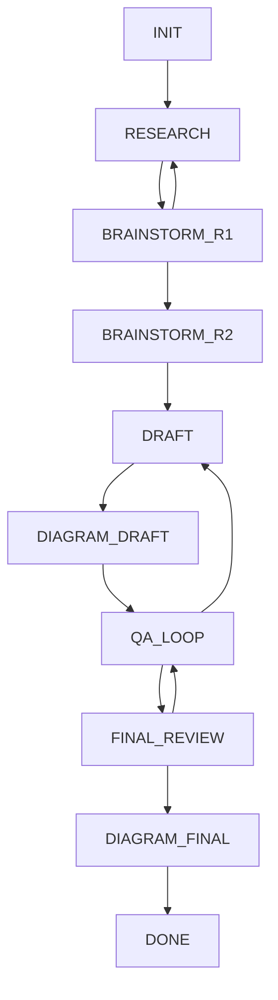

# Workflow reference

[Documentation](./README-en.md) · [中文](./workflow-diagram.md)

## Stage transitions

This diagram follows the ten stages and allowed transitions in
[WorkflowMachine](../src/core/workflow.ts). Arrows mean that a transition is allowed;
they do not imply that the machine runs agents or checks scoring gates automatically.

| Stage | Purpose |
|---|---|
| `INIT` | Prepare the project and its working context |
| `RESEARCH` | Gather prior-art evidence and analyze the technical landscape |
| `BRAINSTORM_R1` | Generate and challenge candidate ideas |
| `BRAINSTORM_R2` | Consolidate specialist evaluations |
| `DRAFT` | Write or revise the disclosure |
| `DIAGRAM_DRAFT` | Prepare and render draft figures |
| `QA_LOOP` | Review issues and technical responses |
| `FINAL_REVIEW` | Review the revised disclosure |
| `DIAGRAM_FINAL` | Refresh figures after final revisions |
| `DONE` | Mark workflow completion |

There are three backward transitions: `BRAINSTORM_R1 → RESEARCH`,
`QA_LOOP → DRAFT`, and `FINAL_REVIEW → QA_LOOP`.
The current machine has no direct `BRAINSTORM_R2 → BRAINSTORM_R1` transition.
Brainstorm rounds and branching are recorded separately in the decision-path system.

## Scoring decisions

The [threshold evaluator](../src/core/threshold-config.ts) reads each innovation's
saved `weightedScore`, `novelty`, and `creativity` values.

| Setting | Default | Effect |
|---|---|---|
| `passToDraft` | 8.5 | Minimum weighted score for a normal pass |
| `redLines.novelty` | 6.0 | Minimum novelty score for a normal pass |
| `redLines.creativity` | 6.0 | Minimum creativity score for a normal pass |
| `forceIteration.maxRounds` | 3 | At this round or later, an otherwise failing result becomes `FORCE_PASS` |
| `forceIteration.minImprovement` | 0.3 | Defined in configuration; currently not used by `evaluateThreshold` |

| Score and round conditions | Returned action |
|---|---|
| Both red lines met and weighted score ≥ 8.5 | `PASS_TO_DRAFT` |
| A red line is missed or weighted score is too low, before round 3 | `ITERATE` |
| A red line is missed or weighted score is too low, at round 3 or later | `FORCE_PASS` |

`FORCE_PASS` can therefore occur even when novelty or creativity is below its red
line. The returned flags and reason retain this information. These are threshold
decisions; evaluating a score does not itself change the workflow stage.

## Review and figures

Archimedes' instructions call for two consecutive QA rounds without new issues
before final polishing. The state machine validates transition paths, while
the orchestrator and reviewers assess the document and record their findings.

Draft and final figures are distinct stages. The diagram agent prepares specifications;
the CLI renders them and updates figure references in an existing `MAIN.md`.
Use explicit final specifications for the final pass, as described in the
[diagram commands](./usage-en.md#diagrams).

## Continuing a project

Workflow state and decision history have separate purposes:

| Record | Use |
|---|---|
| `.patent/state.json` | Persist the current stage and stage status |
| `.brainstorm/path.json` and round files | Trace ideas, scores, decisions, and branches |
| `references/` | Preserve research and specialist outputs |
| `MAIN.md` and `figures/` | Maintain the disclosure and rendered figures |

Continuing a project uses these saved files. Creating a decision-path branch does
not roll back the whole working directory or automatically restore a workflow state.

See [agents and collaboration](./agents-en.md),
[project architecture](./architecture-en.md), and [usage](./usage-en.md).
