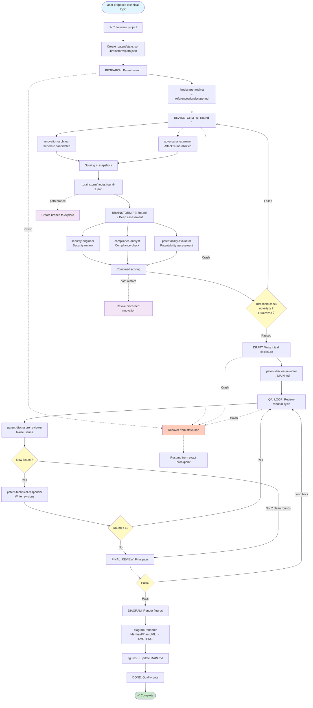
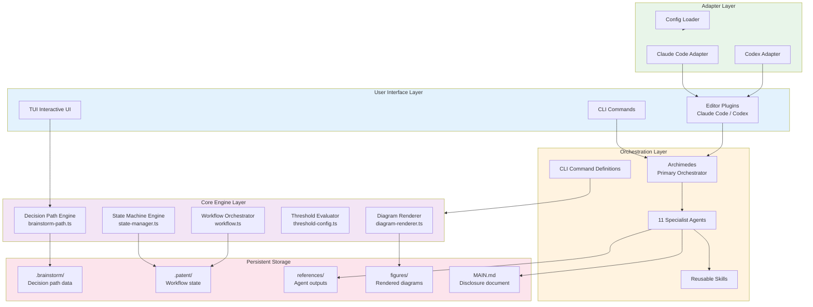
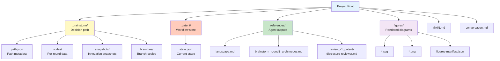
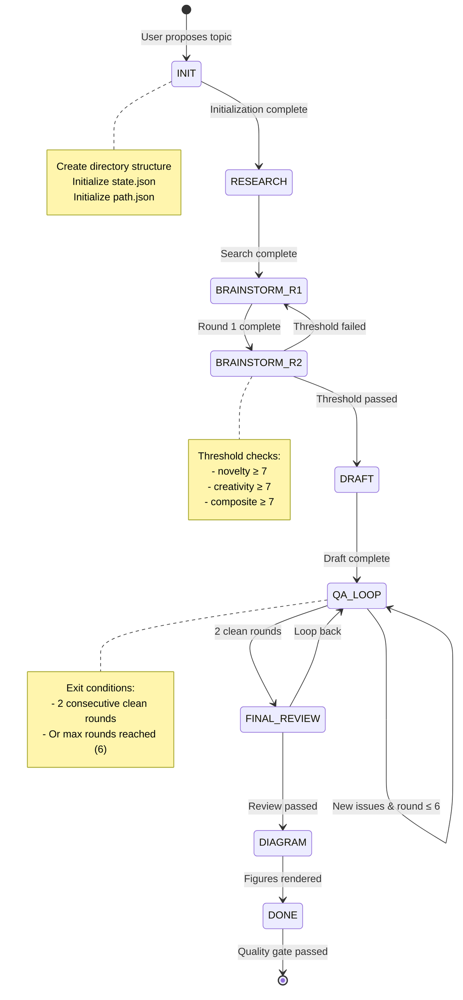

# oh-my-patent Workflow Diagrams

This document provides visual workflow diagrams for oh-my-patent.

## End-to-End Workflow



## System Architecture



## Agent Collaboration

```mermaid
graph LR
    subgraph Input["Input Stage"]
        User[User] --> Topic[Technical Topic]
    end
    
    subgraph Search["Search Stage"]
        Topic --> Analyst[patent-landscape-analyst]
        Analyst --> Landscape[landscape.md]
    end
    
    subgraph Brainstorm["Brainstorm Stage"]
        Landscape --> Architect[patent-innovation-architect]
        Architect --> Innovations[Innovation Candidates]
        
        Innovations --> Adversarial[patent-adversarial-examiner]
        Innovations --> Security[patent-security-engineer]
        Innovations --> Compliance[patent-product-compliance-analyst]
        Innovations --> Evaluator[patentability-evaluator]
        
        Adversarial --> Scores[Combined Scores]
        Security --> Scores
        Compliance --> Scores
        Evaluator --> Scores
    end
    
    subgraph Draft["Draft Stage"]
        Scores --> Writer[patent-disclosure-writer]
        Writer --> MainMd[MAIN.md Draft]
    end
    
    subgraph QA["Review Stage"]
        MainMd --> Reviewer[patent-disclosure-reviewer]
        Reviewer --> Issues[Issue List]
        Issues --> Responder[patent-technical-responder]
        Responder --> Revision[Revised Version]
        Revision --> Reviewer
    end
    
    subgraph Finalize["Finalize Stage"]
        Revision --> Moderator[patent-brainstorm-moderator]
        Moderator --> Final[Final Version]
        Final --> Recorder[patent-path-recorder]
        Recorder --> Complete[✅ Complete]
    end
    
    style Input fill:#e1f5ff
    style Search fill:#fff9c4
    style Brainstorm fill:#ffccbc
    style Draft fill:#c8e6c9
    style QA fill:#f3e5f5
    style Finalize fill:#b2dfdb
```



## Decision Path Data Structure

```mermaid
graph TD
    Path[BrainstormPath] --> Metadata[Metadata<br/>projectId, topic, status]
    Path --> Nodes[Node List<br/>nodes: string[]]
    Path --> Edges[Edge List<br/>edges: Edge[]]
    Path --> Current[Current Node<br/>currentNodeId]
    Path --> Final[Final Decision<br/>finalDecision]
    
    Nodes --> Node1[Round 1 Node]
    Nodes --> Node2[Round 2 Node]
    Nodes --> NodeN[Round N Node]
    
    Node1 --> NodeData[Node Data]
    NodeData --> AgentOutputs[Agent Outputs]
    NodeData --> Innovations[Innovation List]
    NodeData --> Scores[Scoring Data]
    NodeData --> Decision[Decision Record]
    
    Edges --> Edge1[Edge 1]
    Edge1 --> Transform[Transformation Type<br/>refine/merge/split/pivot]
    Edge1 --> Changes[Change Description]
    
    style Path fill:#e3f2fd
    style Metadata fill:#fff9c4
    style NodeData fill:#c8e6c9
    style Transform fill:#f3e5f5
```

## File System Layout



## Workflow State Machine



---

## Viewing Instructions

### On GitHub

GitHub natively supports Mermaid rendering. View this document in the repository to see the full visualizations.

### Local Rendering

Use a Markdown editor with Mermaid support:
- VS Code + Markdown Preview Mermaid Support extension
- Obsidian
- Typora
- GitHub Desktop

### Export as Images

Using Mermaid CLI:

```bash
npm install -g @mermaid-js/mermaid-cli
mmdc -i docs/workflow-diagram-en.md -o docs/workflow-diagram-en.pdf
```

Or use online editors:
- https://mermaid.live/
- https://mermaid-js.github.io/mermaid-live-editor/
