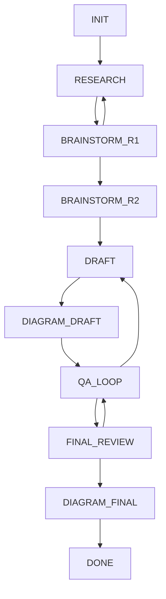

# 工作流说明

[文档中心](./README.md) · [English](./workflow-diagram-en.md)

## 阶段转换

下图依据 [WorkflowMachine](../src/core/workflow.ts) 中的十个阶段与允许转换。
箭头表示允许转换，不表示状态机会自动调用智能体或检查评分门槛。

| 阶段 | 用途 |
|---|---|
| `INIT` | 准备项目与工作上下文 |
| `RESEARCH` | 收集现有技术证据，分析技术全景 |
| `BRAINSTORM_R1` | 生成候选构思并提出质疑 |
| `BRAINSTORM_R2` | 汇总专业智能体的评估 |
| `DRAFT` | 撰写或修订交底书 |
| `DIAGRAM_DRAFT` | 准备并渲染初稿附图 |
| `QA_LOOP` | 审查问题与技术答复 |
| `FINAL_REVIEW` | 审核修订后的交底书 |
| `DIAGRAM_FINAL` | 根据最终修订更新附图 |
| `DONE` | 标记流程完成 |

有三条返回前序阶段的路径：`BRAINSTORM_R1 → RESEARCH`、
`QA_LOOP → DRAFT`、`FINAL_REVIEW → QA_LOOP`。
当前状态机没有直接的 `BRAINSTORM_R2 → BRAINSTORM_R1` 转换。
头脑风暴轮次与分支由决策路径系统单独记录。

## 评分决策

[阈值评估器](../src/core/threshold-config.ts)读取每个创新点已保存的
`weightedScore`、`novelty` 和 `creativity`。

| 配置 | 默认值 | 作用 |
|---|---|---|
| `passToDraft` | 8.5 | 正常通过所需的最低综合分 |
| `redLines.novelty` | 6.0 | 正常通过所需的最低新颖性分 |
| `redLines.creativity` | 6.0 | 正常通过所需的最低创造性分 |
| `forceIteration.maxRounds` | 3 | 达到或超过该轮次时，未达标结果变为 `FORCE_PASS` |
| `forceIteration.minImprovement` | 0.3 | 配置中已定义，但当前 `evaluateThreshold` 未使用 |

| 分数与轮次条件 | 返回动作 |
|---|---|
| 两条红线均满足，且综合分 ≥ 8.5 | `PASS_TO_DRAFT` |
| 未满足红线或综合分不足，且未到第 3 轮 | `ITERATE` |
| 未满足红线或综合分不足，且已到第 3 轮或之后 | `FORCE_PASS` |

因此，即使新颖性或创造性低于红线，也可能返回 `FORCE_PASS`。
返回的标志位与理由会保留未达标信息。这些属于评分决策；
执行阈值评估本身不会改变工作流阶段。

## 审查与附图

Archimedes 指令要求连续两轮 QA 没有新增问题后进入最终润色。
状态机校验转换路径；编排器与审查者负责评估文档并记录结论。

初稿附图与最终附图是两个独立阶段。附图智能体准备规格，
CLI 负责渲染，并更新已有 `MAIN.md` 中的引用。
最终渲染应显式提供最终规格，详见[附图命令](./usage.md#附图)。

## 继续已有项目

工作流状态与决策历史各有用途：

| 记录 | 用途 |
|---|---|
| `.patent/state.json` | 保存当前阶段与各阶段状态 |
| `.brainstorm/path.json` 及轮次文件 | 追踪构思、评分、决策与分支 |
| `references/` | 保存检索结果和专业智能体产出 |
| `MAIN.md` 与 `figures/` | 保存交底书与渲染后的附图 |

继续项目依赖这些已保存文件。创建决策路径分支不会回滚整个工作目录，
也不会自动恢复工作流状态。

继续阅读[智能体协作](./agents.md)、[项目架构](./architecture.md)与[使用指南](./usage.md)。
