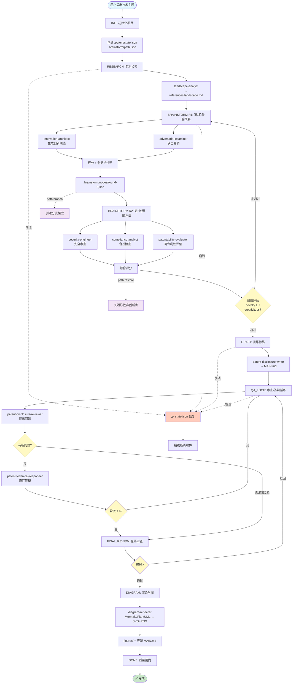
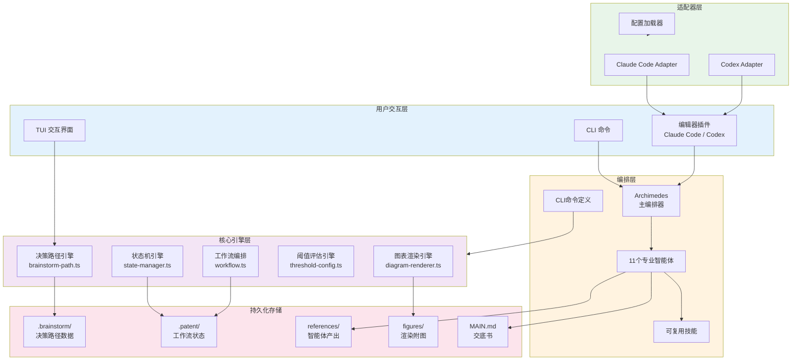
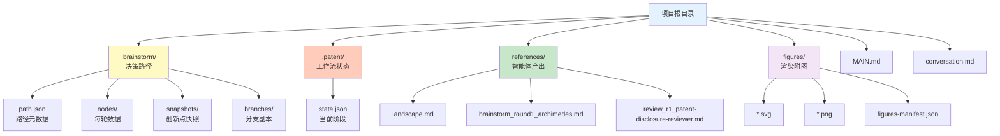
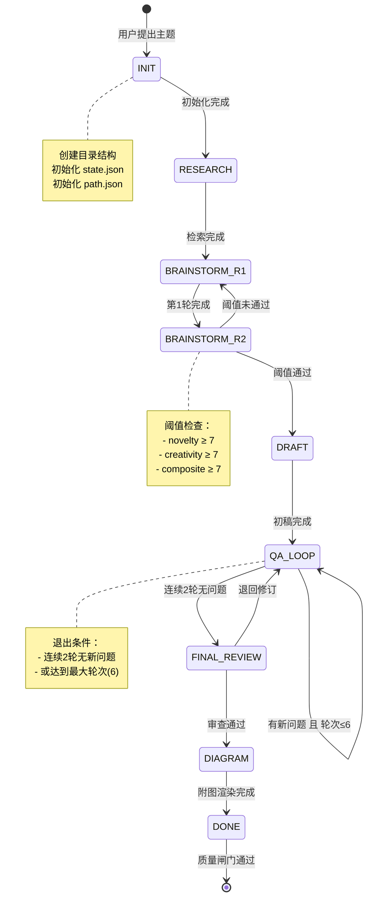

# oh-my-patent 工作流图示

本文档提供 oh-my-patent 的可视化工作流程图。

## 端到端工作流



## 系统架构图



## 智能体协作图

```mermaid
graph LR
    subgraph Input["输入阶段"]
        User[用户] --> Topic[技术主题]
    end
    
    subgraph Search["检索阶段"]
        Topic --> Analyst[patent-landscape-analyst]
        Analyst --> Landscape[landscape.md]
    end
    
    subgraph Brainstorm["头脑风暴阶段"]
        Landscape --> Architect[patent-innovation-architect]
        Architect --> Innovations[创新候选]
        
        Innovations --> Adversarial[patent-adversarial-examiner]
        Innovations --> Security[patent-security-engineer]
        Innovations --> Compliance[patent-product-compliance-analyst]
        Innovations --> Evaluator[patentability-evaluator]
        
        Adversarial --> Scores[综合评分]
        Security --> Scores
        Compliance --> Scores
        Evaluator --> Scores
    end
    
    subgraph Draft["撰写阶段"]
        Scores --> Writer[patent-disclosure-writer]
        Writer --> MainMd[MAIN.md 初稿]
    end
    
    subgraph QA["审查阶段"]
        MainMd --> Reviewer[patent-disclosure-reviewer]
        Reviewer --> Issues[问题清单]
        Issues --> Responder[patent-technical-responder]
        Responder --> Revision[修订版本]
        Revision --> Reviewer
    end
    
    subgraph Finalize["完成阶段"]
        Revision --> Moderator[patent-brainstorm-moderator]
        Moderator --> Final[最终版本]
        Final --> Recorder[patent-path-recorder]
        Recorder --> Complete[✅ 完成]
    end
    
    style Input fill:#e1f5ff
    style Search fill:#fff9c4
    style Brainstorm fill:#ffccbc
    style Draft fill:#c8e6c9
    style QA fill:#f3e5f5
    style Finalize fill:#b2dfdb
```



## 决策路径数据结构

```mermaid
graph TD
    Path[BrainstormPath] --> Metadata[元数据<br/>projectId, topic, status]
    Path --> Nodes[节点列表<br/>nodes: string[]]
    Path --> Edges[边列表<br/>edges: Edge[]]
    Path --> Current[当前节点<br/>currentNodeId]
    Path --> Final[最终决策<br/>finalDecision]
    
    Nodes --> Node1[Round 1 Node]
    Nodes --> Node2[Round 2 Node]
    Nodes --> NodeN[Round N Node]
    
    Node1 --> NodeData[节点数据]
    NodeData --> AgentOutputs[智能体产出]
    NodeData --> Innovations[创新点列表]
    NodeData --> Scores[评分数据]
    NodeData --> Decision[决策记录]
    
    Edges --> Edge1[Edge 1]
    Edge1 --> Transform[转换类型<br/>refine/merge/split/pivot]
    Edge1 --> Changes[变更描述]
    
    style Path fill:#e3f2fd
    style Metadata fill:#fff9c4
    style NodeData fill:#c8e6c9
    style Transform fill:#f3e5f5
```

## 文件系统布局



## 工作流状态机



---

## 使用说明

### 在 GitHub 上查看

GitHub 原生支持 Mermaid 渲染。直接在仓库中查看本文档即可看到完整的可视化图表。

### 本地渲染

使用支持 Mermaid 的 Markdown 编辑器：
- VS Code + Markdown Preview Mermaid Support 插件
- Obsidian
- Typora
- GitHub Desktop

### 导出为图片

使用 Mermaid CLI：

```bash
npm install -g @mermaid-js/mermaid-cli
mmdc -i docs/workflow-diagram.md -o docs/workflow-diagram.pdf
```

或使用在线编辑器：
- https://mermaid.live/
- https://mermaid-js.github.io/mermaid-live-editor/
